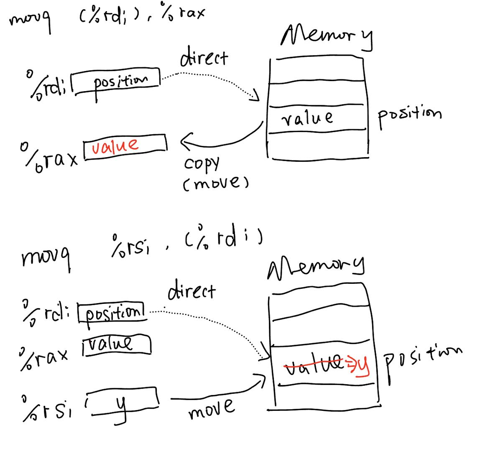
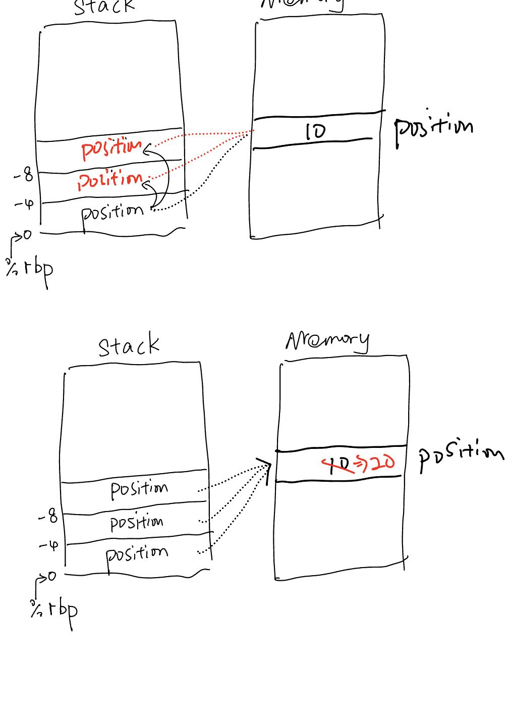

# Note of Chapter 3: Machine-Level Reprecentation of Programs

## 3.4.3 Data Movement Example

In this section, an example is offered like below:

```C
long exchange(long *xp, long y){
    long x = *xp;
    *xp = y;
    return x;
}
```

In this function, anthough *xp is changed by the line "*xp = y", 
the value of x will not be changed though. (Which means the function will 
return the original value pointed to by xp.) This feature of the C may be confused for
those who used to program in python and are new to C. However, the 
assembly code clarifies the underlying logic.

```
exchange:
    movq    (%rdi), %rax
    movq    %rsi, (%rdi)
    ret
```

After execute the intstruction "long x = *xp", which correspond to the 
assembly code "movq    (%rdi), %rax", the address stored in %rdi is used to
locate the position in the memory. The value stored in the memory is copied
and stored in the register %rax. After doing this, the value stored in %rdi,
which correspond to y, is copied and stored in the original position in the 
memory. However, in this process, %rax is not changed.



However, how can we write a value-change process? It seems a little bit
weird, but it worth a think.

We can write C code like below:

```C
int exchange_new(){
    int a = 10;
    int *p = &a;
    int *q = &a;
    *q = 20;
    return *p;
}
```

This code may be compile like below:

```
exchange_new:

    pushq   %rbp
    movq    %rsp, %rbp
    subq    $24, %rsp       

    movl $10, -4(%rbp)    # int a = 10;

    leaq -4(%rbp), %rax   # int *p = &a;
    movq %rax, -8(%rbp)

    leaq -4(%rbp), %rax   # int *q = &a;
    movq %rax, -16(%rbp)

    movq -8(%rbp), %rax   # *p = 20;
    movl $20, (%rax)

    leave
    ret

```

This actually involves the structure of the stack, but we can ignore
that for now. We only need to look at why *p and *q change together. 
It should be noted that *p = &a is a special shorthand in C, which 
means that the pointer p stores the address of a, i.e., p is a pointer 
to a. This process can be represented by the following diagram.

